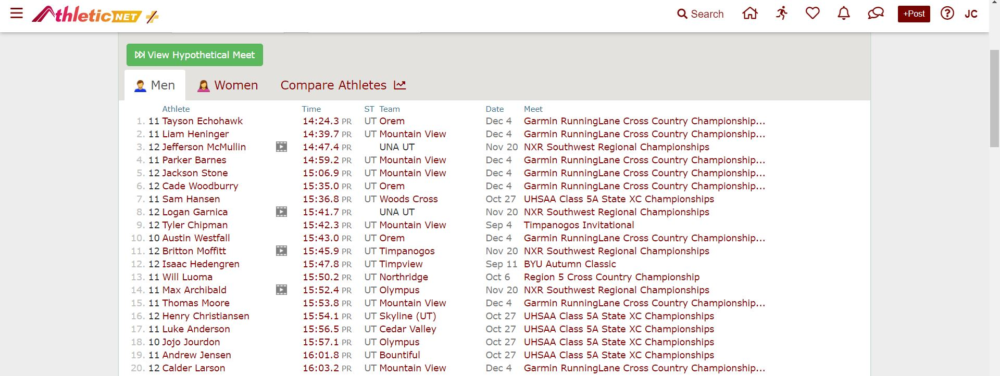
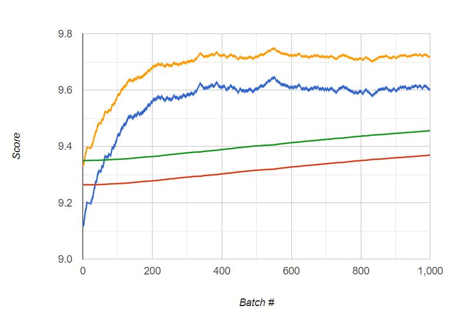
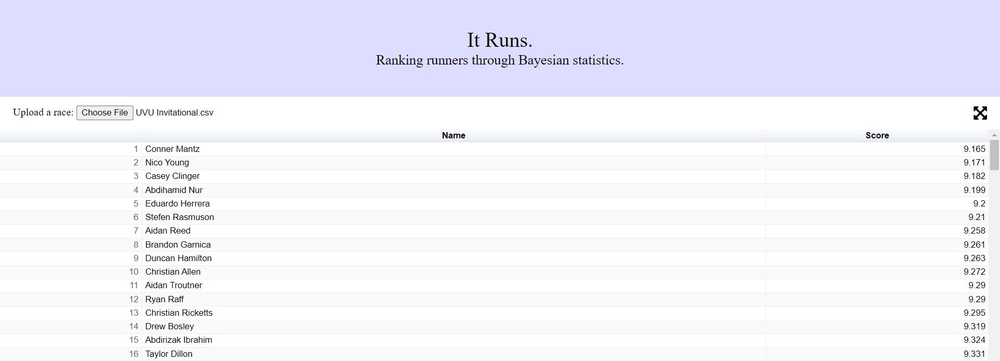

# It Runs.
## Installation

    git clone https://github.com/cooljoseph1/XCRankings.git

## Ranking runners through Bayesian statistics.
Currently the top runner ranking systems are either purely time-based or subjective. Here are the 2021 Utah HS Boys rankings according to Athletic.net:

MileSplit has both this time-based rankings and compiles a subjective "Top50" list. Unfortunately it's all behind a paywall.

Every race is different, so a time-based ranking system doesn't work too well. If you notice, four of the top five Utah times on Athletic.net come from the same race, "Garmin RunningLane Cross Country Championship." That's because this race was in Alabama, at 600ft elevation, whereas Utah sits at 6,000ft elevation. Elevation isn't the only factor that affects a race. Some races are wet and muddy; others are hot and dusty. Some have more hills, and others are even as much as 0.2 miles longer (almost an entire minute for top runners)! A subjective rating system can work better, but... it's subjective. It's impossible to know how the rankers are biased.

This system uses machine learning and Bayesian statistics to create an objective model that is robust to racing conditions. We assign scores to each runner. If one runner has a score half that of another, it should take them approximately half the time to finish the same race. We take the race time-data and assign an error,
  

  
summed over all pairs of scores and times in every race. We add the following prior to the scores:
  

  
which is a Rayleigh distribution (approximately proportional to the population mile-time distribution). We chose σ=100, but it doesn't really matter where you center the distribution. Combining the error and the prior gives a loss function:
  

  
where we take a log to be consistent with the error. We chose α = 1, β = 0.1, but if you want more spread you could decrease β. To minimize this loss, we used batched gradient descent. Each race is considered as a single batch. We repeatedly select batches, calculate the gradient for that batch, and then follow along the gradient to update the scores. They converge relatively quickly to good scores.

The scores reflect true skill well. The top ranked runner is Conner Mantz, who won the NCAA Championship in 2021. Nico Young placed second. Also near the top is Aiden Troutner, who won the high school Nike Cross Nationals in 2017.

